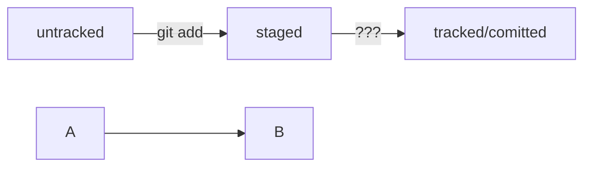

# Git — заметки

## Основные команды Git:
```bash
git init                # Инициализация репозитория
git clone <URL>         # Клонирование репозитория
git add <file>          # Добавление файла в индекс
git commit -m "Сообщение"  # Создание коммита
git push origin main    # Отправка изменений
git pull origin main    # Получение обновлений
git status              # Проверка состояния
git log                 # История коммитов
git log --oneline       # История коммитов (кратко)
git branch              # Просмотр веток
git checkout -b new-branch  # Создание и переход в новую ветку
git merge new-branch    # Слияние ветки
git commit --amend --no-edit    # Дополнить файл коммита
git commit --amend -m "Новое сообщение"    # Изменить сообщение коммита

git restore --staged <file>    # Выполнить unstage изменений
git reset --hard <commit hash>    # «Откатить» коммит
```

## Работа с ветками:
```bash
git branch -m master main	#Переименовать master в main
git branch temp-branch  # Создаст новую ветку с текущими изменениями
git checkout main       # Вернёт тебя в main
git merge temp-branch   # Объединит изменения в main
git branch -d temp-branch  # Удалит временную ветку (если больше не нужна)
```

## Работа с файлами и папками:
```bash
pwd                    # Показать текущую папку
cd ~/dev/first-project # Перейти в проект
cd .git/               # Перейти в папку Git
rm readme.txt          # Удалить файл
touch README.md        # Создать файл
echo "Hello, Git!" > README.md  # Записать в файл
cat README.md          # Посмотреть содержимое
mv oldname.txt newname.txt  # Переименовать файл
cp file.txt copy.txt   # Скопировать файл
ls -l                 # Показать файлы в папке
```

## Откат изменений:
```bash
git reset --hard HEAD~1  # Удалит последний коммит локально
git push --force         # Перезапишет удалённый репозиторий (⚠ Опасно, изменит историю)
```

⚠ **Важно:**  
Вместо `--force` **лучше использовать** `--force-with-lease`, так как он проверяет, что в удалённом репозитории **не появилось новых коммитов**, и защищает от случайной потери изменений:  
```bash
git push --force-with-lease
```

---

### 🔍 Как узнать, сколько коммитов из одной ветки ещё не попали в другую

Если нужно проверить, сколько коммитов из ветки `feature/add-txt` ещё не попали в основную ветку `main`, используй следующие команды:

#### 📄 Показать список коммитов, которые есть в `feature/add-txt`, но нет в `main`:
```bash
git log main..feature/add-txt --oneline
```

#### 🔢 Показать только количество таких коммитов:
```bash
git rev-list --count main..feature/add-txt
```

#### 🔁 Показать коммиты, которые есть в `main`, но отсутствуют в `feature/add-txt`:
```bash
git log feature/add-txt..main --oneline
```

#### 🧠 Визуализировать структуру веток:
```bash
git log --oneline --graph --decorate --all
```

---

## 💡 Инфинитив и императив  

Для сообщений на **русском** языке часто рекомендуют использовать **инфинитивы**. Например:  
✅ **Добавить тесты для PipkaService**  
✅ **Исправить ошибку #123**  

Для сообщений на **английском** языке используют **повелительное наклонение (imperative)**. Например:  
✅ **Use library mega_lib_300**  
✅ **Fix exit button**  

Эти рекомендации сложились исторически, и им следуют многие проекты.  

---

## 🚀 **Conventional Commits — шаблон для коммитов (расширенный)**

### **🔤 Шаблон названия коммита / Commit Title**

```
<тип>(<область>): <краткое описание>
```

**Примеры:**

- `feat(ui): added dark mode`
    
- `fix(auth): fixed login bug`
    
- `refactor(core): simplified logic of movement`
    
- `ci(github): added auto-deploy to production`
    
- `test(player): added unit tests for jump`
    
- `ai(npc): improved pathfinding heuristics`
    
- `chore(deps): updated Unity packages`
    

---

### 🧩 **Типы `<тип>` — что произошло**

|Тип|Описание|
|---|---|
|`feat`|Новая функциональность|
|`fix`|Исправление багов|
|`docs`|Обновление документации|
|`style`|Изменения, не влияющие на поведение (отступы, форматирование)|
|`refactor`|Улучшение внутренней логики без изменения функционала|
|`perf`|Оптимизация производительности|
|`test`|Добавление или обновление тестов|
|`chore`|Обслуживание проекта (зависимости, скрипты, мелочи)|
|`ci`|Настройка CI/CD|
|`build`|Всё, что связано со сборкой (webpack, Unity build pipeline и т.д.)|
|`ai`|Работа с ML/AI логикой|
|`input`|Изменения в системе ввода|
|`config`|Изменения в конфигурации (например, `.editorconfig`, `manifest.json`)|
|`revert`|Откат предыдущих изменений|

---

### 🧭 **Области `<область>` — на что повлияло изменение**

|Область|Примерное назначение|
|---|---|
|`ui`|Интерфейс|
|`auth`|Аутентификация|
|`player`|Игрок, управление персонажем|
|`npc`|Искусственный интеллект|
|`core`|Основная логика проекта|
|`audio`|Аудиосистема, музыка, звуки|
|`deps`|Зависимости|
|`build`|Сборка|
|`editor`|Расширения и скрипты для редактора Unity|
|`shader`|Шейдеры и визуальные эффекты|
|`physics`|Физика|
|`scene`|Сцены Unity|
|`config`|Конфиги (проекта, плагинов и т.д.)|
|`tools`|Вспомогательные утилиты или скрипты|

---

### 📄 **Шаблон описания коммита / Commit Description**

```
Changes:
- <Что конкретно изменилось>.
- <Какие файлы или системы затронуты>.

Why:
- <Причина: фича, баг, запрос, оптимизация и т.д.>.

How:
- <Как реализовано: алгоритмы, подход, использованные технологии>.
```

**Пример:**

```
Changes:
- Улучшена логика движения NPC с использованием A*.
- Переписан скрипт `NpcNavigator.cs`.

Why:
- Старый алгоритм застревал на сложных картах.

How:
- Заменён поиск пути на A* с кастомной эвристикой.
```

---

### 💻 **Команды для терминала / Terminal Commands**

```bash
git add .
git commit -m "<тип>(<область>): <краткое описание>"
git push origin <ветка>
```

---

### 📌 **Как пользоваться?**

1. Выбери **тип** изменений.
    
2. Определи **область** влияния.
    
3. Напиши **заголовок** коммита.
    
4. Заполни **описание** по шаблону: что, зачем и как.
    
5. Зафиксируй изменения: `git add .`, `git commit`, `git push`.
    

---

### 📦 **Полезные надстройки и фичи на будущее**

- **`BREAKING CHANGE:`** — добавить в описание для важных изменений API или архитектуры
    
- **Ссылки на задачи:** `Closes #123`, `Related to #456`
    
- **Метки прогресса:** `WIP:`, `READY:` — можно использовать в заголовке или теле коммита
    
- **Пре-коммит хуки:** Используй [Husky](https://typicode.github.io/husky) или [Commitlint](https://commitlint.js.org/) для автоматической проверки формата 

---
### **Mermaid-схема**

