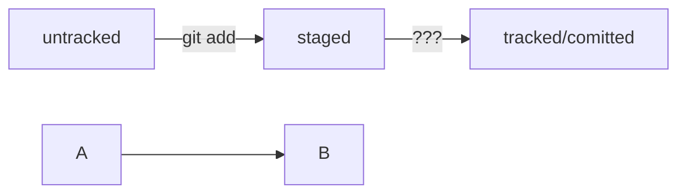

# Git — заметки

## Основные команды Git:
```bash
git init                # Инициализация репозитория
git clone <URL>         # Клонирование репозитория
git add <file>          # Добавление файла в индекс
git commit -m "Сообщение"  # Создание коммита
git push origin main    # Отправка изменений
git pull origin main    # Получение обновлений
git status              # Проверка состояния
git log                 # История коммитов
git log --oneline       # История коммитов (кратко)
git branch              # Просмотр веток
git checkout -b new-branch  # Создание и переход в новую ветку
git merge new-branch    # Слияние ветки
git commit --amend --no-edit    # Дополнить файл коммита
git commit --amend -m "Новое сообщение"    # Изменить сообщение коммита

git restore --staged <file>    # Выполнить unstage изменений
git reset --hard <commit hash>    # «Откатить» коммит
```

## Работа с ветками:
```bash
git branch -m master main	#Переименовать master в main
git branch temp-branch  # Создаст новую ветку с текущими изменениями
git checkout main       # Вернёт тебя в main
git merge temp-branch   # Объединит изменения в main
git branch -d temp-branch  # Удалит временную ветку (если больше не нужна)
```

## Работа с файлами и папками:
```bash
pwd                    # Показать текущую папку
cd ~/dev/first-project # Перейти в проект
cd .git/               # Перейти в папку Git
rm readme.txt          # Удалить файл
touch README.md        # Создать файл
echo "Hello, Git!" > README.md  # Записать в файл
cat README.md          # Посмотреть содержимое
mv oldname.txt newname.txt  # Переименовать файл
cp file.txt copy.txt   # Скопировать файл
ls -l                 # Показать файлы в папке
```

## Откат изменений:
```bash
git reset --hard HEAD~1  # Удалит последний коммит локально
git push --force         # Перезапишет удалённый репозиторий (⚠ Опасно, изменит историю)
```

⚠ **Важно:**  
Вместо `--force` **лучше использовать** `--force-with-lease`, так как он проверяет, что в удалённом репозитории **не появилось новых коммитов**, и защищает от случайной потери изменений:  
```bash
git push --force-with-lease
```

---

## 💡 Инфинитив и императив  

Для сообщений на **русском** языке часто рекомендуют использовать **инфинитивы**. Например:  
✅ **Добавить тесты для PipkaService**  
✅ **Исправить ошибку #123**  

Для сообщений на **английском** языке используют **повелительное наклонение (imperative)**. Например:  
✅ **Use library mega_lib_300**  
✅ **Fix exit button**  

Эти рекомендации сложились исторически, и им следуют многие проекты.  

---

## Conventional Commits — шаблон для коммитов  

### **Шаблон названия коммита / Commit Title**  
```  
<тип>(<область>): <краткое описание>
```  
**Примеры:**  
- `feat(ui): added dark mode`  
- `fix(auth): fixed login bug`  
- `chore(deps): updated dependencies`  

**Расшифровка структуры:**  
- **`<тип>`** — что произошло:  
  - `feat` — новая фича  
  - `fix` — исправление багов  
  - `chore` — технические обновления  
  - `refactor` — улучшение кода без изменения функционала  
  - `perf` — оптимизация  
  - `docs` — изменения в документации  
  - `style` — исправления стиля (отступы, форматирование и т. д.)  
- **`<область>`** — что изменилось:  
  - `ui` — интерфейс  
  - `auth` — аутентификация  
  - `deps` — зависимости  
  - `build` — сборка проекта  
  - `config` — настройки проекта  

---

### **Шаблон описания коммита / Commit Description**  
```  
Changes:  
- <Что изменилось>.  
- <Дополнительные детали>.  

Why:  
- <Причина изменения>.  

How:  
- <Как было реализовано>.  
```  

**Пример:**  
```  
Changes:  
- Обновлён UI, добавлен тёмный режим.  
- Улучшены стили кнопок.  

Why:  
- Запрос пользователей на кастомизацию темы.  

How:  
- Добавлены стили в `style.css`.  
- Добавлен переключатель в `settings.js`.  
```  

---

### **Шаблон команд для терминала / Terminal Commands**  
```bash  
git add .  
git commit -m "<тип>(<область>): <краткое описание>"  
git push origin <ветка>  
```  

---

### **Как пользоваться?**  
1. Выбери **тип** коммита.  
2. Определи **область** (что изменилось).  
3. Напиши **краткое описание** в заголовке.  
4. В описании укажи **что изменилось, почему и как**.  
5. Добавь изменения, закоммить и запушь.  

---
### **Mermaid-схема**

